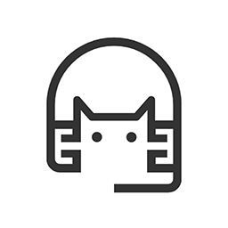

<div align="center">

# Necokara

**A desktop karaoke subtitle video maker — lyrics editing, beat timing & effects composition**

[🇨🇳 中文](#zh) · [🇬🇧 English](#en)

<br>



</div>

---

## <span id="zh">🇨🇳 中文</span>

### 📖 简介

Necokara 是一款桌面端卡拉OK字幕视频制作工具，支持歌词编辑、节拍打轴与合成渲染。

> 🚧 **Alpha 阶段** — 核心功能可运行，仍在积极开发中。

### ✨ 功能

- **歌词导入/编辑** — 支持 TXT、LRC、NicoLRC、JSON 格式
- **逐音节节拍打轴** — 精确到音节的 timing 编辑器
- **自动打轴** — MDX 人声分离 + Whisper 语音识别强制对齐，多语言支持；可选分离缓存复用、伴奏残留清理、对齐到 32 分音符；全程无需 ffmpeg
- **资源模型配置** — 自备模型目录设置，自动检测与校验（分离 / 对齐模型）
- **项目文件** — 保存/打开 `.nekoproj` 项目，支持密码加密
- **撤销/重做** — 全功能撤销管理器
- **自动更新** — 通过 GitHub Releases 检测更新

### 🖼️ 截图

> 待补充

### 📦 下载

从 [Releases](https://github.com/Chrollis/Necokara/releases) 获取最新版本：

| 平台    | 格式                                                     |
| ------- | -------------------------------------------------------- |
| Windows | `Necokara-Setup-x.x.x_win64.exe`（安装版）               |
| Windows | `Necokara-Portable-x.x.x_win64.exe`（便携版，免安装）    |
| Linux   | `Necokara-x.x.x_linux64.AppImage`（需在 Linux 环境构建） |

### 🧠 模型下载（用户自带）

Necokara **不捆绑任何模型**，由用户自行从官方源下载（bring-your-own model），应用仅提供下载辅助脚本与资源配置。

```bash
node models/download-model.mjs            # 下载全部模型（人声分离 + 语音对齐）
node models/download-model.mjs vocal      # 仅人声分离模型
node models/download-model.mjs whisper    # 仅语音对齐模型
node models/download-model.mjs --list     # 查看可用模型
```

- 模型许可证遵循各模型页声明（如 whisper MIT、MDX-Net OpenRAIL），请自行确认是否符合你的使用场景
- 下载完成后，在应用「资源配置」中指向模型目录即可使用
- 应用内**不内置一键下载**，仅提供此辅助脚本供用户手动运行

### 🔧 从源码构建

```bash
git clone https://github.com/Chrollis/Necokara.git
cd Necokara
npm install
npm run package       # 打包 Windows 版本
npm run package:win   # Windows
npm run package:linux # Linux（需 Linux 环境）
npm run package:mac   # macOS（需 macOS 环境）
```

### 🧱 技术栈

| 技术             | 用途     |
| ---------------- | -------- |
| Electron 35      | 桌面框架 |
| React 19         | UI 框架  |
| TypeScript 5.8   | 编程语言 |
| Webpack 5        | 构建工具 |
| electron-builder | 打包分发 |

### 📄 许可证

[GNU General Public License v3.0](LICENSE)

---

## <span id="en">🇬🇧 English</span>

### 📖 Introduction

Necokara is a desktop karaoke subtitle video maker with lyrics editing, beat timing and effects composition.

> 🚧 **Alpha stage** — core features are functional, actively under development.

### ✨ Features

- **Lyrics import / editing** — TXT, LRC, NicoLRC, JSON format support
- **Per-syllable beat timing** — precise timing editor down to individual syllables
- **Auto timing** — MDX vocal separation + Whisper forced alignment, multi-language; optional cached-vocals reuse, residue cleanup, and 32nd-note snapping; no ffmpeg required
- **Resource model config** — bring-your-own model directory with auto-detection & validation (separate / align)
- **Project files** — save/open `.nekoproj` projects with optional password encryption
- **Undo / Redo** — full-featured undo manager
- **Auto-update** — update detection via GitHub Releases

### 🖼️ Screenshots

> TBD

### 📦 Download

Get the latest build from [Releases](https://github.com/Chrollis/Necokara/releases):

| Platform | Format                                                                  |
| -------- | ----------------------------------------------------------------------- |
| Windows  | `Necokara-Setup-x.x.x_win64.exe` (installer)                            |
| Windows  | `Necokara-Portable-x.x.x_win64.exe` (portable)                          |
| Linux    | `Necokara-x.x.x_linux64.AppImage` (requires Linux environment to build) |

### 🧠 Model download (bring-your-own)

Necokara does **not bundle any models** — users download them from the official sources. The app only provides a helper download script and a resource config.

```bash
node models/download-model.mjs            # download all models (vocal separation + speech alignment)
node models/download-model.mjs vocal      # vocal separation model only
node models/download-model.mjs whisper    # speech alignment model only
node models/download-model.mjs --list     # list available models
```

- Model licenses follow each model page (e.g. whisper MIT, MDX-Net OpenRAIL) — verify they fit your use case
- After downloading, point the app's "Resource Config" at the model directory
- The app does **not** download models itself; the script is provided for users to run manually

### 🔧 Build from source

```bash
git clone https://github.com/Chrollis/Necokara.git
cd Necokara
npm install
npm run package       # build for Windows
npm run package:win   # Windows
npm run package:linux # Linux (requires Linux)
npm run package:mac   # macOS (requires macOS)
```

### 🧱 Tech Stack

| Tech             | Role                     |
| ---------------- | ------------------------ |
| Electron 35      | Desktop framework        |
| React 19         | UI framework             |
| TypeScript 5.8   | Language                 |
| Webpack 5        | Build tooling            |
| electron-builder | Packaging & distribution |

### 📄 License

[GNU General Public License v3.0](LICENSE)
